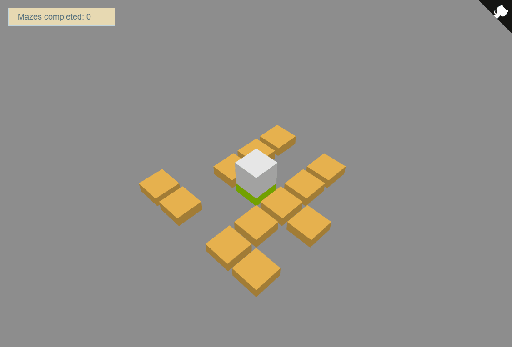

# Maze game

[](https://github.com/darteil/MazeGame/blob/master/LICENSE.md) [](https://gitlab.com/darteil_projects/MazeGame/commits/master)



### Installation and run project.

Switch to "dev" branch.
Install dependencies and start:

```sh
$ npm install
$ npm start
```

### Other

Check code formatting errors:

```sh
$ npm run lint
```

### Using libraries

[Babylon.js](https://www.babylonjs.com/),
[Konva](https://konvajs.org/)

### License

MIT License, Copyright (c) 2020-2021 Romanov Yuri
